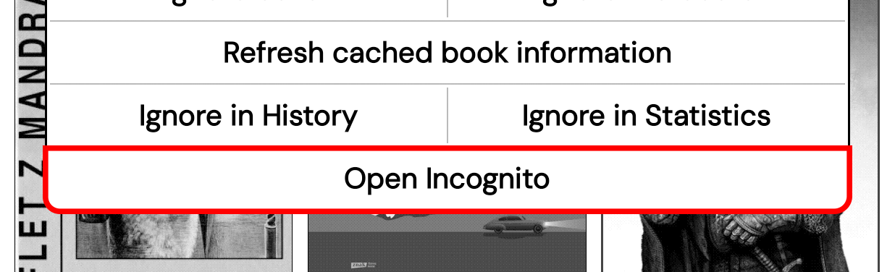

# incognito.koplugin 

A KOReader plugin that lets you open a book without leaving any trace.

## What it does

When you open a book via **Open Incognito**:

- no entry is added to reading history
- reading progress is not saved
- document settings are not written to disk
- reading statistics are not recorded
- `.sdr` sidecar folders are not created or modified

Once you close the reader, everything is back to normal.

## Screenshot

## Installation

Copy the `incognito.koplugin` folder to the `plugins/` and restart KOReader.

## Usage

Long-press any book in the file browser → tap **Open Incognito**.

## Compatibility

Tested on KOReader 2025.10. and night Should work on any recent version.

#### My  [User Patches](https://github.com/Craftwork2720/koreader-patches) for KOReader. ❤️
